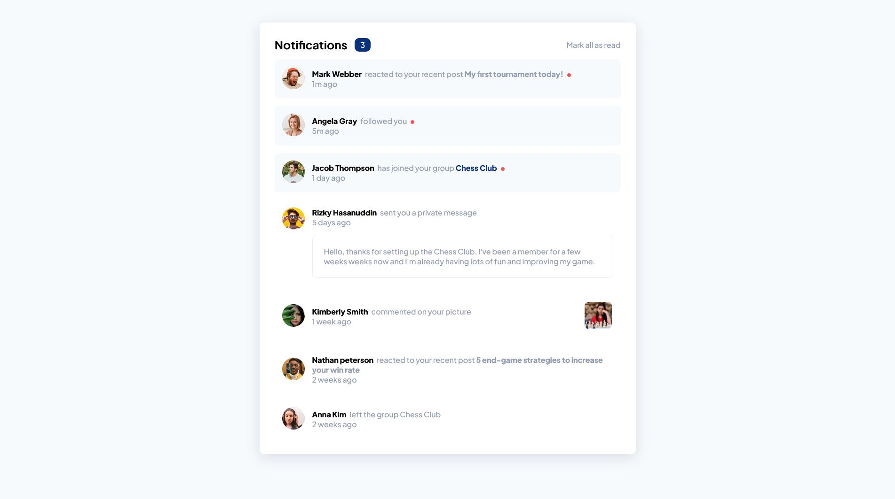

# Frontend Mentor - Notifications page solution

This is a solution to the [Notifications page challenge on Frontend Mentor](https://www.frontendmentor.io/challenges/notifications-page-DqK5QAmKbC). Frontend Mentor challenges help you improve your coding skills by building realistic projects. 

## Table of contents

- [Overview](#overview)
  - [The challenge](#the-challenge)
  - [Screenshot](#screenshot)
  - [Links](#links)
- [My process](#my-process)
  - [Built with](#built-with)
  - [What I learned](#what-i-learned)
  - [Continued development](#continued-development)
  - [Useful resources](#useful-resources)
- [Author](#author)
- [Acknowledgments](#acknowledgments)

**Note: Delete this note and update the table of contents based on what sections you keep.**

## Overview

### The challenge

Users should be able to:

- Distinguish between "unread" and "read" notifications
- Select "Mark all as read" to toggle the visual state of the unread notifications and set the number of unread messages to zero
- View the optimal layout for the interface depending on their device's screen size
- See hover and focus states for all interactive elements on the page

### Screenshot

### Links

- Solution URL: [https://lordyner.github.io/notifications-page/]
- Challenge specs: [https://www.frontendmentor.io/challenges/notifications-page-DqK5QAmKbC)

## My process
 
 I started by studying the desktop and mobile layouts with the different states. Then I created my css variables with the fonts and colours.
 After that I typed all the html and content and started to work on the style. I started with the main container and then created a notification-container. I didn't face any difficulties, the layout was pretty simple and straightforward.

### Built with

- Semantic HTML5 markup
- CSS custom properties
- Flexbox
- Mobile-first workflow
- [React](https://reactjs.org/) - JS library

### Continued development

I want to keep practice integration of layout for different screen size and work with media queries.

### Useful resources

- [Doc media queries](https://developer.mozilla.org/fr/docs/Web/CSS/Media_Queries/Using_media_queries) - Usefull to remind myself of how it works
- [Shadow examples](https://getcssscan.com/css-box-shadow-examples) -Helpful to quickly get a shadow example

## Author

- Github - [Lordyner](https://github.com/Lordyner)
- Frontend Mentor - [@Lordyner](https://www.frontendmentor.io/profile/Lordyner)

## Acknowledgments

Thanks to Kevin Powell for making me discover through his content this amazing website
